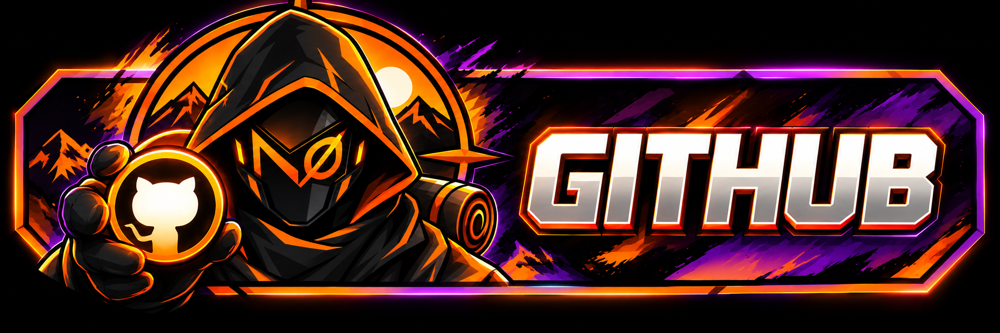

<p align="center">
  
</p>

**N3DCO** is a customisable, animated 3D controller overlay for OBS Studio on Windows.

Display your controller in real time with animated buttons, sticks, triggers, D-pad input, controller status, custom colours, faceplate skins, visual effects, multiple camera angles, and dedicated input displays.

> **N3DCO is currently in active pre-release development.**

## 📥 Download

### **[Download the latest release](https://github.com/N0M4Dcode/N0M4D-s-3D-Controller-Overlay/releases)**

Please use the packaged builds from the **Releases** page rather than downloading the repository source directly.

N3DCO is distributed as a portable Windows application. Extract the complete ZIP before running it.

---

## ✨ Features

### 🎮 Real-Time 3D Controller

- Animated physical button presses.
- Animated analogue sticks.
- Trigger pressure animation.
- Animated bumpers and D-pad.
- Directional thumbstick glow rings.
- Trigger-pressure glow.
- Direction-specific D-pad highlighting.
- Controller connection and disconnection feedback.
- Smooth model dimming when a controller disconnects.
- Battery and charging indicators when supported by the device.
- Connection-sensitive status lighting.

### 🎨 Customisation

- Independent highlight profiles for supported controller types.
- Controller-wide highlight colours.
- Individual control colour overrides.
- Customisable:
  - Bumpers
  - Trigger rings
  - Stick rings
  - Stick clicks
  - D-pad
  - Menu/system controls
  - Supported PlayStation controls
  - Guitar controls
- Xbox controller body and trim colour customisation.
- Built-in colour presets.
- Original-colour reset.
- Custom Xbox faceplate skins.
- 2048 × 2048 PNG skin import.
- Downloadable UV guide.
- Persistent customisation settings.

### ✨ Visual Effects

Optional effects include:

- **Button-press pulse** — a short highlight burst when supported controls are pressed.
- **Fading stick trails** — visual directional trails around analogue sticks.
- **Trigger-pressure glow** — trigger rings become brighter as pressure increases.
- **Connection animation** — a short animation when a controller connects.

Effects are individually configurable and can be disabled.

### 📷 Multiple Views

N3DCO supports independent controller views and input displays, including:

- Face camera.
- Rear camera.
- Both controller cameras.
- Inputs only.
- Face + inputs.
- Rear + inputs.
- All elements.

Camera views support independent rotation, positioning and zoom.

### ⌨️ Input Displays

- Horizontal input readout.
- Vertical input readout.
- Optional numeric stick values.
- Input highlights follow the configured controller colours.
- Inputs-only OBS sources do not need to render the 3D model.

### 📺 OBS Integration

One running N3DCO instance can supply multiple OBS Browser Sources.

Dedicated links can be generated for:

- Face view.
- Rear view.
- Both cameras.
- Horizontal inputs.
- Vertical inputs.
- Combined controller and input layouts.

Each generated source URL can retain its own controller, camera, skin, body colour and layout configuration.

The overlay background is transparent, so **no chroma key is required**.

---

# 🖥️ N3DCO Studio

Starting with the **0.2** release, N3DCO Studio is a dedicated Windows desktop experience.

The configuration interface no longer needs to open in a separate browser tab.

N3DCO uses **Microsoft WebView2** to embed the existing Studio interface and 3D renderer directly inside the application.

### Studio includes

- Resizable desktop interface.
- Live 3D controller configuration.
- Embedded overlay previews.
- Controller selection.
- Camera controls.
- Skin management.
- Colour customisation.
- Effect configuration.
- OBS source generation.
- Update checking.
- Support links.

Launching N3DCO again while it is already running brings the existing Studio window back instead of starting another instance.

Closing Studio keeps N3DCO running in the Windows system tray.

---

## 🎮 Controller Support

Current controller support includes:

- **Xbox / standard XInput controllers**
- **PlayStation 4 controllers**
- **PlayStation 5 controllers**
- **PDP Riffmaster guitar**

PlayStation input is handled natively through SDL3.

Controller-specific functionality depends on what information Windows and the device driver expose.

Some battery, charging, system-button or device-specific information may therefore vary depending on the controller and connection method.

Additional controller types are planned as development continues.

---

## 🎸 Riffmaster Support

N3DCO includes support for the PDP Riffmaster guitar, including supported guitar-specific input and visual feedback.

Customisable guitar elements include:

- Fret input.
- Start.
- Star Power.
- Strum feedback.
- Whammy effects.
- Guitar-specific highlight colours.

---

## 💻 Requirements

- Windows 10 or Windows 11, 64-bit.
- OBS Studio for streaming/overlay use.
- Microsoft Edge WebView2 Runtime.
- Windows PowerShell.
- A supported controller.

The portable package includes the required application runtimes and graphics libraries.

You **do not** need to separately install:

- Node.js
- .NET
- Blender
- Visual Studio
- VS Code

Node.js remains bundled with the portable application.

Internet access is not required for normal controller/OBS operation, although features such as update checking and external links require internet access.

---

# 📦 Installation

1. Download the latest portable Windows ZIP from the **[Releases](https://github.com/N0M4Dcode/N0M4D-s-3D-Controller-Overlay/releases)** page.
2. Extract the **entire ZIP** into a writable folder.
3. Keep all bundled files and folders together.
4. Run:

```text
Nomads3DCOverlay.exe
```

5. N3DCO Studio will open once the local service is ready.
6. Connect and configure your controller.
7. Generate the OBS source links you want to use.

> **Do not run N3DCO directly from inside the ZIP archive.**

---

# 🎛️ Setting Up a Controller

1. Connect your controller to the PC.
2. Open N3DCO Studio.
3. Select the required controller from the **Controller** selector.
4. Select the appropriate input labels where applicable.
5. Configure your controller appearance.
6. Position the required camera views.
7. Configure input displays and effects.
8. Copy the required OBS source URL.

### Camera Controls

- **Left-drag:** Rotate.
- **Right-drag:** Reposition.
- **Mouse wheel:** Zoom.

Settings can be stored locally and included in generated OBS source URLs.

---

# 📺 Adding N3DCO to OBS

In OBS Studio:

1. Click **+** under **Sources**.
2. Select **Browser**.
3. Paste the URL generated by N3DCO Studio.
4. Set the Browser Source dimensions appropriate for the selected layout.
5. Confirm the source.
6. Position and resize it within your scene.

N3DCO provides recommended Browser Source dimensions inside Studio for the selected output type.

### Transparent Background

N3DCO outputs a transparent background.

You do **not** need to add a chroma-key filter.

### Multiple Sources

You can create separate Browser Sources for different N3DCO elements.

For example:

```text
Controller Face
Controller Rear
Controller Inputs
```

All of them can receive input from the same running N3DCO instance.

---

# 🔋 Battery & Connection Indicators

| State | Indicator |
|---|---|
| Full battery | Three green segments |
| Medium battery | Two amber segments |
| Low / empty battery | Pulsing red segment |
| Wired connection reported | Blue pulse |
| Charging explicitly reported | Repeating fill animation |
| Battery information unavailable | Dim neutral ring |
| Controller disconnected | Status lighting turns off and the model dims |

Battery support depends on the controller, driver and connection method.

XInput typically exposes coarse battery states rather than an exact percentage.

Connecting a USB charging cable also does not guarantee that Windows reports the controller as charging.

---

# 🔄 Updating N3DCO

N3DCO includes a built-in **Check for Updates** function.

Starting with **0.2.0.1**, the updater correctly checks the N3DCO GitHub repository and supports releases marked as **Pre-release**.

This allows N3DCO to continue receiving development releases while the project remains in its pre-release stage.

When manually upgrading:

1. Quit the currently running N3DCO instance from the system tray.
2. Download the new release.
3. Extract it into a new folder.
4. Transfer your existing settings/skins if required.
5. Start the new version.

Do not run multiple N3DCO versions simultaneously.

---

# 💾 Settings & User Data

N3DCO stores portable configuration data separately from the embedded Studio browser cache.

User configuration includes items such as:

- Layout settings.
- Controller customisation.
- Highlight settings.
- Effect configuration.
- Imported skins.

WebView2 browser cache is stored separately in the user's Windows **Local AppData** directory.

When moving to a new portable release, keep a backup of your existing `data` directory before deleting an older installation.

---

# 🛠️ Troubleshooting

## Studio does not open

Make sure the **Microsoft Edge WebView2 Runtime** is installed.

N3DCO provides startup guidance and a runtime download option if WebView2 cannot be found.

## Overlay does not load in OBS

Make sure N3DCO is currently running.

The local overlay service must remain active for OBS Browser Sources to receive controller information.

## Port 3210 is already in use

Make sure another N3DCO instance or development server is not already using the local service port.

N3DCO includes single-instance handling, but manually started development services may still conflict with the packaged application.

## No controller input

- Check that the controller is connected.
- Confirm the correct controller is selected in Studio.
- Check the controller's operating mode.
- Reconnect the device if necessary.

If the input reader fails to start, review:

```text
launcher.log
```

## Settings do not save

Make sure the extracted N3DCO folder is in a writable location.

Do not run the application directly from inside the downloaded ZIP.

## Charging is not shown

The controller or driver may not expose charging information to Windows.

A USB cable being connected does not necessarily mean Windows reports the device as charging.

## OBS shows an old layout

A previously generated OBS URL may contain an older snapshot of your configuration.

Generate and copy a fresh source URL from N3DCO Studio after changing source-specific settings.

---

# 🚧 Pre-release Status

N3DCO is currently an **active pre-release project**.

Features, controller support, UI elements and internal systems may continue to change as development progresses.

The **0.2** release introduced the dedicated desktop Studio using Microsoft WebView2 while retaining the existing local rendering and OBS integration system.

Version **0.2.0.1** also fixes the built-in update system so future N3DCO pre-release versions can be detected correctly.

Bug reports, controller compatibility feedback and testing across different Windows/OBS configurations are welcome.

---

# 🙏 Credits

## Controller Model

The controller model is based on **Xbox Controller** by **wilsonR**:

https://sketchfab.com/3d-models/xbox-controller-a8d4bbaecf004885bfd68fe79b0c2077

Licensed under **[CC BY 4.0](https://creativecommons.org/licenses/by/4.0/)**.

The model has been modified in Blender for N3DCO, including control separation, materials, UV work and additional visual elements.

The original model creator does not endorse or sponsor N3DCO.

The model's CC BY licence does not automatically apply to the N3DCO application source code.

## Third-Party Components

N3DCO uses third-party components including:

- Three.js
- SDL3
- Node.js
- Microsoft .NET
- Microsoft WebView2

Applicable third-party licence notices are included with the portable release in the:

```text
licenses
```

directory.

---

# ☕ Support & Follow

If you enjoy N3DCO and would like to support its development, you can buy me a coffee, follow the project on YouTube, or check out my other work on GitHub.

<p align="center">
  <a href="https://buymeacoffee.com/n0m4d">
    
  </a>
</p>

<p align="center">
  <a href="https://www.youtube.com/channel/UC51wCpcVe3cglUBtS6rZTPQ">
    
  </a>
</p>

<p align="center">
  <a href="https://github.com/N0M4Dcode">
    
  </a>
</p>

---

## 🔗 Links

**[Releases](https://github.com/N0M4Dcode/N0M4D-s-3D-Controller-Overlay/releases)** · **[GitHub Profile](https://github.com/N0M4Dcode)** · **[YouTube](https://www.youtube.com/channel/UC51wCpcVe3cglUBtS6rZTPQ)** · **[Buy Me a Coffee](https://buymeacoffee.com/n0m4d)**

---

Made by **N0M4Dcode**.
